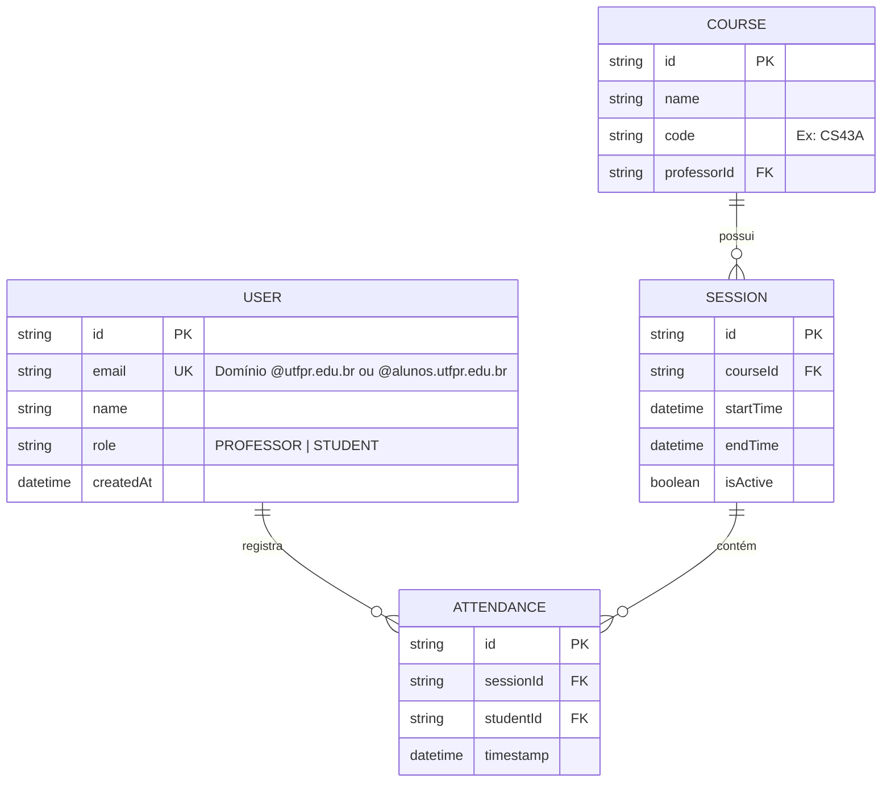

# 📐 Software Design Document (SDD) - Tô Aqui!

**Projeto:** Tô Aqui! (AutoPresence UTFPR)  
**Versão:** 1.0.0  
**Status:** 🟢 Pronto para Implementação  
**Stack Principal:** NestJS, Angular, Prisma ORM, PostgreSQL.

---

## 🏗️ 1. Arquitetura do Sistema (Estrutura Monorepo)

O projeto utiliza uma arquitetura de Monorepo. O Agente de IA deve respeitar a seguinte estrutura de pastas:

* **`apps/api`**: Servidor Backend (NestJS). Padrão: `Module` -> `Controller` -> `Service` -> `Prisma/Repository`.
* **`apps/web`**: Aplicação Client (Angular 17+). Utilizar `Standalone Components` e `Signals`.
* **`apps/extension`**: Ponte de integração (Chrome Extension). Vanilla TypeScript para manipulação de DOM.

## 🤖 2. Orquestração e Contexto de IA (MCP)
> Configuração dos contextos Model Context Protocol para que o Agente da IDE entenda as fronteiras e regras do backend.

* **Database MCP (Neon.tech):** Contexto do esquema PostgreSQL real via Prisma Introspection.
* **GitHub MCP:** Leitura das **Issues** do repositório para orientar o fluxo **TDD (Test-Driven Development)** e fechamento automático de tarefas.
* **OpenAPI Context:** Instrução para que o Agente gere Controllers e DTOs respeitando rigorosamente os contratos da Seção 4.

## 📦 3. Stack Tecnológica e Bibliotecas
> Definição estrita das tecnologias permitidas. Nenhuma dependência externa deve ser instalada sem refletir aqui.

* **Core:** NestJS 10+ (Framework Modular).
* **ORM:** Prisma (PostgreSQL) - Interface oficial com o banco de dados.
* **Auth:** Passport.js + JWT (JSON Web Tokens) para sessões seguras.
* **Validação:** `class-validator` e `class-transformer` (Pipes globais).
* **Documentação:** `@nestjs/swagger` (OpenAPI 3.0 para ID12).
* **Utilitários:** `date-fns` para lógica de expiração rigorosa do QR Code (15s).

## 🗄️ 4. Arquitetura de Dados

### 📖 4.1. Glossário Técnico (Mapeamento)
| Termo PRD (PT-BR) | Entidade Técnica (EN) | Atributos Principais |
| :--- | :--- | :--- |
| Usuário | `User` | `id, email, name, role` |
| Disciplina | `Course` | `id, name, code, professorId` |
| Chamada / Sessão | `Session` | `id, courseId, startTime, isActive` |
| Presença | `Attendance` | `id, sessionId, studentId, timestamp` |

### 🗄️ 4.2. Modelagem de Dados (Dicionário de Entidades)

> **Instrução para a IA:** Utilize este diagrama Mermaid como fonte da verdade para gerar o arquivo `schema.prisma` e as migrações do banco de dados.

## 📑 5. Contratos Globais (DTOs & Interfaces)
> Tipagem TypeScript para validação de entrada (Request) e saída (Response).

* **AuthDTO:** `{ idToken: string }` -> Retorna Token JWT + Perfil do Usuário.
* **CreateSessionDTO:** `{ courseId: string, durationMinutes: number }` (Exclusivo Professor).
* **CheckInDTO:** `{ qrToken: string }` -> O `qrToken` é um JWT assinado com validade de 15 segundos.

## 🏗️ 6. Scaffolding Macro (Arquitetura Backend)

### 📂 6.1. Estrutura de Módulos (Domain-Driven)
* **`src/modules/auth/`**: Gestão de identidade e estratégia de proteção JWT.
* **`src/modules/sessions/`**: Lógica de abertura de chamadas e geração do Payload do QR.
* **`src/modules/attendance/`**: Validação de check-in (ID7) e persistência de presenças.
* **`src/common/`**: Interceptors de resposta e Exception Filters (ID9).

### 🧠 6.2. Core Services (Singleton)
| Service | Responsabilidade Macro |
| :--- | :--- |
| `PrismaService` | Gerenciar conexão e pooling com o banco PostgreSQL (Neon.tech). |
| `AuthService` | Validar e-mail institucional e emitir Tokens de Acesso. |
| `QrTokenService` | Assinar e verificar tokens JWT efêmeros para o QR Code (Segurança). |

## 🛡️ 7. Segurança (API Protection)
> Políticas de acesso e integridade dos dados no nível do servidor.

* **ValidationPipe:** Configurado com `whitelist: true` para ignorar campos não mapeados nos DTOs.
* **JWT Expiry:** Tokens de usuário (8h); Tokens de QR Code (15 segundos).
* **CORS:** Restrito ao domínio do Frontend e à origem da Extensão Chrome.
* **Rate Limit:** Proteção contra ataques de força bruta na rota de check-in.

## 📡 8. Contratos de API (Especificação OpenAPI)

> **Instrução para a IA:** Implemente os Controllers e DTOs seguindo rigorosamente estas definições.

### 🔐 Módulo de Autenticação (Google OAuth2)
* **POST** `/auth/google`
    * **Payload:** `{ "idToken": "string" }`
    * **Regra:** Validar e-mail institucional; se não existir no DB, criar novo usuário.
    * **Retorno:** `{ "accessToken": "string", "user": { "id", "role", "name" } }`

### 📅 Módulo de Sessões (Exclusivo Professor)
* **POST** `/sessions`
    * **Payload:** `{ "courseId": "string", "durationMinutes": 110 }`
* **GET** `/sessions/:id/qr-payload`
    * **Lógica:** Gerar um JWT efêmero (15s) assinado contendo o `sessionId`.

### 🖋️ Módulo de Presença (Aluno)
* **POST** `/attendance/check-in`
    * **Payload:** `{ "qrToken": "string" }`
    * **Validação:** Verificar assinatura/expiração do token e impedir duplicidade de check-in.

---

